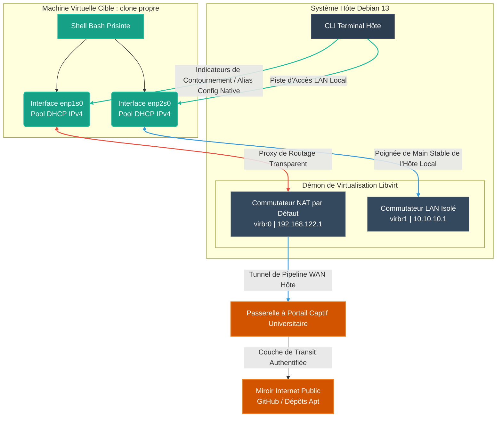

# Guide d'Architecture et d'Optimisation du Réseau de l'Hyperviseur KVM

Ce document fournit les plans d'architecture et les spécifications techniques pour l'environnement de mise en réseau virtuel à double interface déployé sur un hôte Linux Debian 13 (Trixie).

## 1. Aperçu Architectural & Énoncé du Problème

Les environnements de développement fonctionnant à l'intérieur de machines virtuelles sont souvent confrontés à des goulots d'étranglement d'accessibilité réseau en raison de règles d'infrastructure institutionnelles strictes :

1. **Passerelles à Portail Captif :** Les réseaux académiques utilisent une authentification obligatoire par portail web. Les VM d'hyperviseur standard de type 2 ou à pont unique ne peuvent pas interagir en toute sécurité avec les miroirs WAN publics, car elles dupliquent l'adresse IP de l'hôte (déclenchant des coupures de connexion) ou nécessitent des boucles d'authentification individuelles redondantes.
2. **Politiques d'Isolement des Appareils :** Les communications hôte-à-invité ou invité-à-invité sont strictement bloquées sur les points d'accès physiques d'entreprise/universitaires en raison des mesures de sécurité d'isolation des clients sans fil.

### La Solution à Double Interface

Pour isoler les pipelines de développement et contourner proprement les contrôles des passerelles universitaires, une **Topologie Virtuelle à Double Adaptateur** a été conçue :

* **Interface Primaire (`enp1s0` / `virbr0`) :** Mappée au **Commutateur NAT par Défaut** de l'hyperviseur. Elle agit comme un routeur proxy sortant privé. L'invité se greffe de manière transparente sur l'état WAN actif de l'ordinateur portable hôte, contournant entièrement les exigences du portail.
* **Interface Secondaire (`enp2s0` / `virbr1`) :** Mappée à un **Commutateur LAN Local Isolé** défini sur mesure. Ce commutateur ne dispose d'aucune liaison WAN transférée par l'hôte. Il fournit un réseau dorsal privé non surveillé sans aucun risque de fuite physique, établissant une communication stable hôte-à-invité et invité-à-invité en grappe maillée.

---

## 2. Topologie du Flux de Trafic



---

## 3. Configurations de Plateforme de la Couche Hôte

### Trame Réseau Isolée Personnalisée

La définition XML suivante établit les limites persistantes du back-end pour le réseau dorsal privé isolé (`isolated-lan`). Cette interface exécute une instance `dnsmasq` légère sur la couche hôte pour distribuer des baux internes, sans appliquer de filtres de masquage de transfert vers les adaptateurs matériels physiques.

```xml
<network>
  <name>isolated-lan</name>
  <bridge name='virbr1' stp='on' delay='0'/>
  <domain name='isolated.lan'/>
  <ip address='10.10.10.1' netmask='255.255.255.0'>
    <dhcp>
      <range start='10.10.10.10' end='10.10.10.250'/>
    </dhcp>
  </ip>
</network>

```

#### Séquence d'Activation

```bash
# Définir, démarrer et activer le démarrage automatique pour le réseau privé isolé
sudo virsh net-define /etc/libvirt/qemu/networks/isolated-lan.xml
sudo virsh net-start isolated-lan
sudo virsh net-autostart isolated-lan

```

---

## 4. Optimisation SSH Transparente (Côté Hôte)

Afin de supprimer la nécessité de saisir les clés d'identité (`drapeau -i`) ou de remplacer manuellement les noms d'utilisateur lors de la connexion SSH aux systèmes virtuels cibles, nous avons exploité les règles de l'analyseur client OpenSSH.

En ajoutant les sous-réseaux cibles directement à l'espace de configuration local, votre système correspond et applique automatiquement les identifiants universitaires chaque fois que vous ciblez une adresse appartenant à l'un ou l'autre bloc de commutateur virtuel.

```text
# Emplacement du chemin : ~/.ssh/config

# Règles de raccourcis automatisés pour les réseaux virtuels locaux
Host 192.168.122.* 10.10.10.*
    User debian
    IdentityFile ~/.ssh/id_ed25519_university
    IdentitiesOnly yes
    ForwardAgent yes

```

**Commande de l'Espace de Travail Résultante :**

```bash
# L'hôte interceptera ceci, changera l'utilisateur pour debian et appliquera le fichier d'identité de manière transparente
ssh 192.168.122.211

```

---

## 5. Modèle d'Instanciation Directe de Métadonnées (SMBIOS XML)

Au lieu de s'appuyer sur des médias optiques externes lourds (`.iso`) pour fournir les chaînes de personnalisation, nous avons configuré la VM pour qu'elle lise les paramètres directement à partir de la couche carte mère synthétique de l'hyperviseur.

En passant des structures `cloud-config` standard dans le XML de configuration du domaine, le démon cloud-init interne évalue en toute sécurité les blocs de configuration immédiatement lors du démarrage à froid.

```xml
<domain type='kvm'>
  <name>clean clone</name>
  <memory unit='KiB'>2097152</memory>
  <vcpu placement='static'>2</vcpu>

  <sysinfo type='smbios'>
    <oemStrings>
      <entry>cloud-config
users:
  - name: debian
    sudo: ALL=(ALL) NOPASSWD:ALL
    shell: /bin/bash
    passwd: "$6$rounds=4096$saltstring$Y8L899Cj/Qz9E8WqA1Fv9p6X3bK8zHkWbO8Mh2w9P/Xv4M8fE4H9y6Z5s/C3wA1.M1Bv3hK8wE4zHkWbO8Mh2w9P/Xv4."
    lock_passwd: false
    ssh_authorized_keys:
      - ssh-ed25519 AAAAC3NzaC1lZDI1NTE5AAAAIOk7dKR1V+PGlKuk8L1o4D6ZWRtdRasRaRZ5GKE+iIl8 mohamed-mahdi.ben-slima@univ-lehavre.fr

network:
  version: 2
  ethernets:
    enp1s0:
      dhcp4: true
    enp2s0:
      dhcp4: true

runcmd:
  - [ ssh-keygen, -A ]
  - [ mkdir, -p, /run/sshd ]
  - [ chmod, 755, /run/sshd ]
  - [ systemctl, restart, ssh ]
      </entry>
    </oemStrings>
  </sysinfo>

  <os>
    <type arch='x86_64' machine='pc-q35-10.0'>hvm</type>
    <smbios mode='sysinfo'/>
    <boot dev='hd'/>
  </os>

  <devices>
    <emulator>/usr/bin/qemu-system-x86_64</emulator>
    
    <disk type='file' device='disk'>
      <driver name='qemu' type='qcow2' cache='none' io='native'/>
      <source file='/var/lib/libvirt/images/clean-clone.qcow2'/>
      <target dev='vda' bus='virtio'/>
    </disk>

    <interface type='network'>
      <source network='default'/>
      <model type='virtio'/>
    </interface>

    <interface type='network'>
      <source network='isolated-lan'/>
      <model type='virtio'/>
    </interface>

    <serial type='pty'>
      <target type='isa-serial' port='0'>
        <model name='isa-serial'/>
      </target>
    </serial>
    <console type='pty'>
      <target type='serial' port='0'/>
    </console>
  </devices>
</domain>

```

---

## 6. Liste de Contrôle de Vérification et de Dépannage

Chaque fois que vous lancez un nouveau clone ou un nœud frère à l'aide de cette structure de mise en réseau, utilisez les commandes de diagnostic suivantes depuis votre terminal hôte pour vous assurer que ses mesures de routage sont saines :

### 1. Surveiller les Baux d'Allocation IP

```bash
# Interroger les mappages actifs sur le segment par Défaut WAN-Relay
sudo virsh net-dhcp-leases default

# Interroger les mappages actifs sur le segment du Réseau Dorsal Local Isolé
sudo virsh net-dhcp-leases isolated-lan

```

### 2. Flux de Dépannage Console en Direct

Si un système ne répond pas à une demande de réseau entrante ou bloque la connectivité pendant le démarrage, vous pouvez contourner entièrement la couche réseau et diffuser le tampon de démarrage interne de l'invité directement dans votre session shell active :

```bash
sudo virsh console "clean clone"

```

*(Appuyez sur **Entrée** une fois pour activer la ligne de connexion. Pour fermer cette connexion de flux de terminal et retourner en toute sécurité dans l'environnement shell hôte de votre ordinateur portable, appuyez sur `Ctrl + ]`)*

### 3. Effacer les Incompatibilités d'Empreinte Cryptographique de l'Hôte

Étant donné que les adresses IP sur les interfaces KVM sont recyclées dynamiquement via le pool DHCP de l'hyperviseur, votre client hôte peut déclencher une alerte s'il détecte un changement d'empreinte digitale par rapport à un déploiement VM antérieur. Videz l'empreinte digitale en cache pour une adresse IP spécifique à l'aide de cette commande :

```bash
ssh-keygen -f "~/.ssh/known_hosts" -R "192.168.122.X"

```